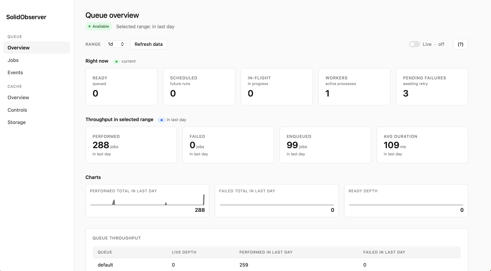
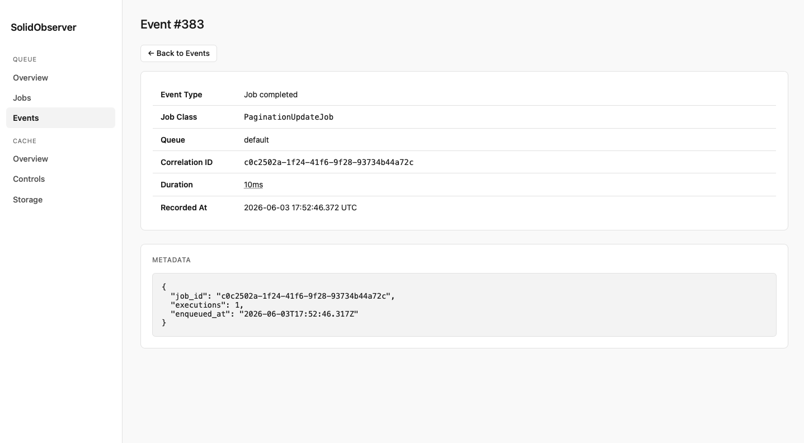
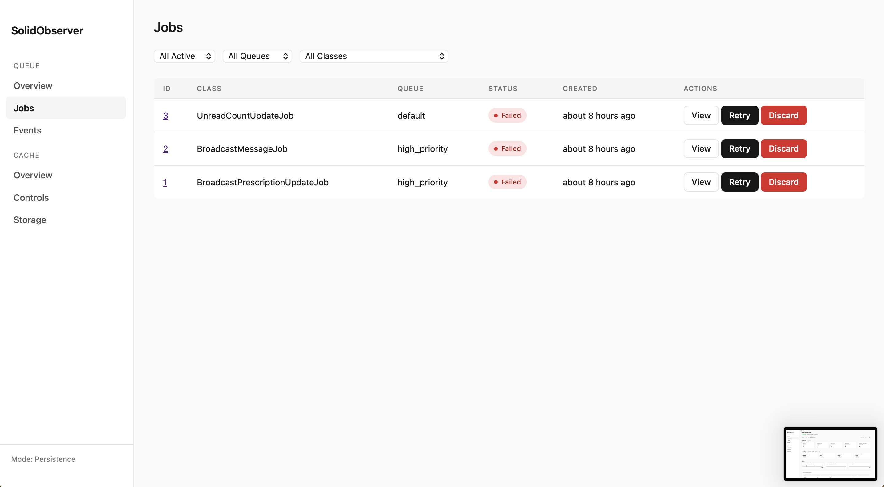
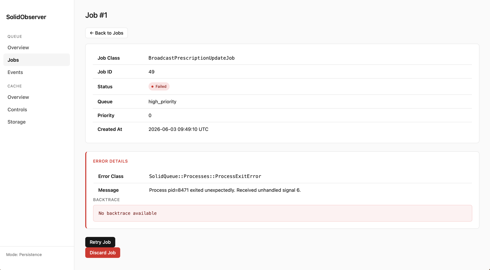
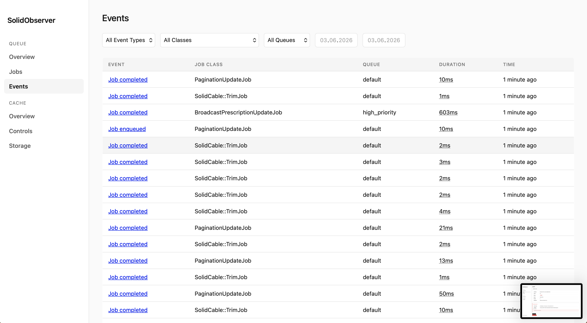
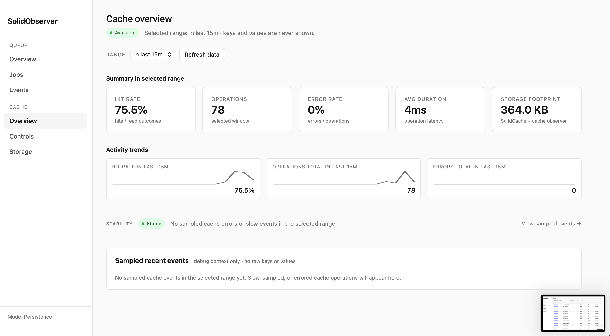
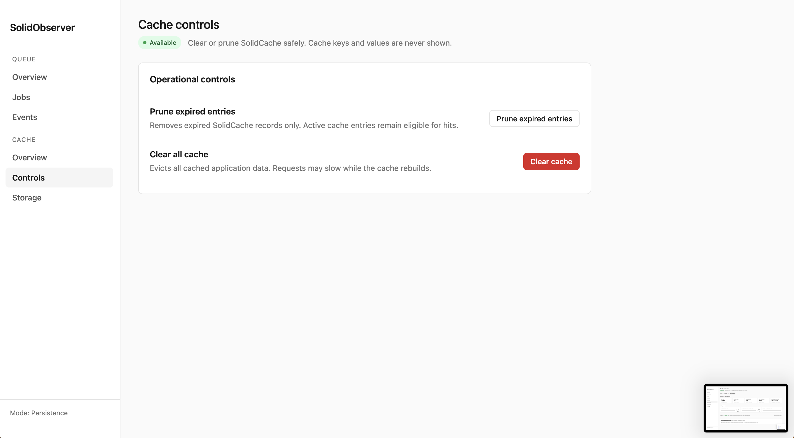
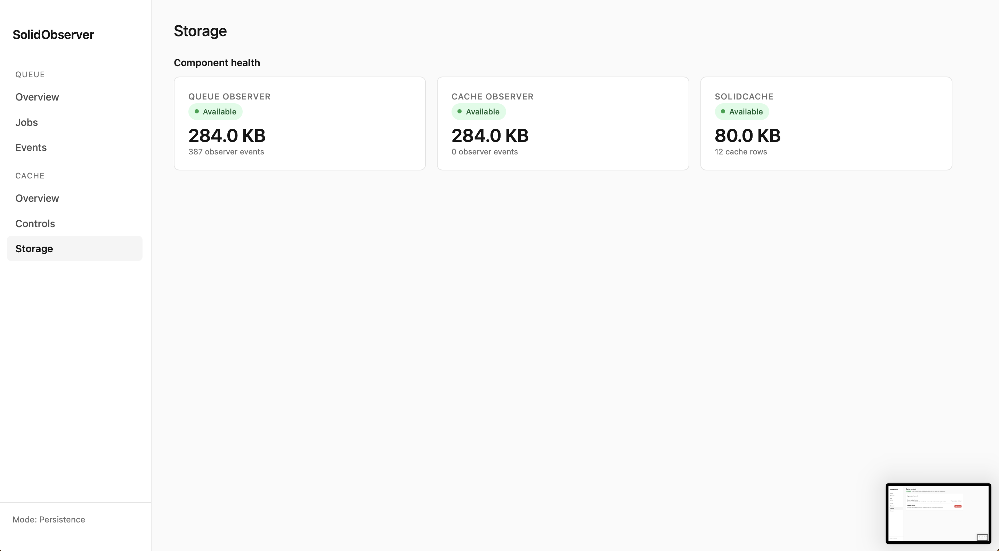

<p align="center">
  <picture>
    <source media="(prefers-color-scheme: dark)" srcset=".github/solid_logo_dark.svg">
    <source media="(prefers-color-scheme: light)" srcset=".github/solid_logo_light.svg">
    
  </picture>
</p>

<p align="center">
  <a href="https://github.com/bart-oz/solid_observer/releases"></a>
  <a href="LICENSE.txt"></a>
  <a href="https://github.com/bart-oz/solid_observer/actions"></a>
  <a href="https://github.com/bart-oz/solid_observer/actions"></a>
</p>

---
<p align="center">
  <a href=".github/assets/dash_1.png"></a>
</p>

SolidObserver is a production-grade observability solution for Rails 8's Solid Stack. v0.4.0 covers both **Solid Queue** and **Solid Cache** with a unified Web UI dashboard, CLI tools, metrics collection, and distributed tracing support.

## Features (v0.4.0)

| | Solid Queue | Solid Cache |
|---|---|---|
| **Web UI Dashboard** | Queue stats, jobs browser, events log | Hit rate, ops/sec, error rate, avg duration |
| **Storage footprint** | DB size, event counts | SolidCache table size, row counts |
| **Activity trends** | Sparklines (Performed, Ready, Failed) | Activity trend sparklines |
| **Stability indicator** | Stable / Degraded / Critical badge | Stability pill badge |
| **Operational controls** | Retry / discard failed jobs | Prune expired entries, clear all entries |
| **CLI tools** | status, jobs:list/show/retry/discard | cache:prune, cache:clear |
| **Privacy** | Job arguments excluded from persisted events | Keys and values **never** shown |
| **Operating modes** | Real-time (no DB) or persistence (full history) | Persistence mode only |

Additional: 🔗 APM distributed tracing · ⚡ buffered writes · 🛡️ Docker/CI/K8s safe boot

## Requirements

- Ruby 3.2+
- Rails 8.0+
- Solid Queue (configured with `connects_to` in all environments)

> **Note:** Ensure Solid Queue is configured with `connects_to` in all environments, not just production. See [Troubleshooting](#troubleshooting) if you encounter database connection issues.

## Installation

Add to your Gemfile:

```ruby
gem "solid_observer"
```

```bash
bundle install
rails generate solid_observer:install
```

SolidObserver supports two operating modes. Choose the one that fits your needs:

### Real-time Mode (no migrations needed)

Get queue monitoring and job management instantly — no database setup required. SolidObserver queries Solid Queue directly.

```ruby
# config/initializers/solid_observer.rb
SolidObserver.configure do |config|
  config.storage_mode = :realtime
end
```

That's it. You now have access to queue status, job listing, retry, and discard commands.

### Persistence Mode (default)

Store event history, metrics, and storage snapshots in a dedicated observer database. This gives you everything in real-time mode plus long-term event tracking, buffered writes, and retention-based cleanup. The install generator defaults to SQLite; the database can use any Rails-supported adapter for record persistence, and storage-size monitoring is implemented for SQLite, PostgreSQL/PostGIS, MySQL, and Trilogy. See [Database Setup](#database-setup-persistence-mode) below.

> If your host app uses a different adapter than SQLite (e.g. PostgreSQL or MySQL), see [Multi-adapter setup](#multi-adapter-setup) before running these commands.

```bash
bin/rails solid_observer:install:migrations
bin/rails db:create
bin/rails db:migrate
```

For SQLite-default apps, no further configuration is needed — persistence is the default `storage_mode`.

## Quick Start

### Check Queue Status

```bash
bin/rails solid_observer:status
```

Output:
```
📊 SolidObserver Status
==================================================

🚀 Solid Queue

| Metric    | Value |
|-----------|-------|
| Ready     | 42    |
| Scheduled | 15    |
| Claimed   | 3     |
| Failed    | 2     |
| Workers   | 4     |

📋 Queue Depths

| Queue      | Jobs |
|------------|------|
| default    | 38   |
| mailers    | 12   |
| critical   | 10   |
```

### Manage Jobs

```bash
# List jobs (defaults to ready jobs)
bin/rails solid_observer:jobs:list

# List failed jobs
bin/rails "solid_observer:jobs:list[failed]"

# Filter by status, queue, job class, and limit
bin/rails "solid_observer:jobs:list[failed,mailers]"
bin/rails "solid_observer:jobs:list[ready,default,UserNotificationJob,50]"

# Inspect a specific job
bin/rails "solid_observer:jobs:show[JOB_ID]"

# Retry a failed job
bin/rails "solid_observer:jobs:retry[JOB_ID]"

# Discard a failed job
bin/rails "solid_observer:jobs:discard[JOB_ID]"
```

### Events Page Filters (Web UI)

Filter dropdowns on `/solid_observer/events` (job class and queue) are cached for 1 minute by default and scoped to the configured retention window.
Tune the cache TTL with `config.filter_cache_ttl`.

### Check Storage (Persistence Mode)

Storage monitoring is cross-adapter: SQLite, PostgreSQL, MySQL, and Trilogy are supported.
SolidObserver uses adapter-native SQL queries to measure size (not filesystem `File.size`),
so production deployments report real values even when the database is remote.

```bash
bin/rails solid_observer:storage
```

Output:
```
💾 Storage Status

| Component | Size    | Events | Usage | Status |
|-----------|---------|--------|-------|--------|
| Queue     | 12.5 MB | 45,231 | 1.2%  | ✓      |

Configuration:
  Retention: 30 days
  Max size:  1024.0 MB per database
  Warning:   80% threshold
```

## Web UI Dashboard

SolidObserver ships with a zero-dependency Web UI (no asset pipeline, no JS framework) at `/solid_observer`.

### Mount

The install generator mounts it for you. To mount manually:

```ruby
# config/routes.rb
mount SolidObserver::Engine, at: "/solid_observer"
```

### Auth Configuration

```ruby
SolidObserver.configure do |config|
  config.ui_enabled          = !Rails.env.production?  # default: true outside production
  config.ui_username         = "admin"                 # HTTP Basic Auth: BOTH username AND password must be set
  config.ui_password         = ENV["SOLID_OBSERVER_PASSWORD"]
  config.ui_base_controller  = "ApplicationController" # name of your host app's base controller (used for API-only detection)
end
```

| Option | Default | Purpose |
|---|---|---|
| `ui_enabled` | `!Rails.env.production?` | Master switch for the Web UI |
| `ui_username` / `ui_password` | `nil` | HTTP Basic Auth. Auth is enabled only when **both** are set |
| `ui_base_controller` | `"ApplicationController"` | Detect API-only apps to include rendering modules |

For production hardening (fail-loud on missing env var vs. fail-open), see [Configuration](#configuration) below.

### Caveats

- **Realtime mode** — Events and Storage navigation links are hidden. Direct visits redirect with a flash alert.
- **API-only apps** — the Web UI works without manual configuration. The engine ships its own Cookies/Session/Flash middleware stack scoped to `/solid_observer/*`.
- **Host-app callbacks are not inherited.** Use `ui_username` / `ui_password` for built-in HTTP Basic Auth.
- **Auth misconfiguration is fail-open, but loud.** If `ui_username` is set but `ui_password` resolves to `nil`, the UI ships unauthenticated and logs a boot `WARNING`.

See the full component breakdown in [Components](#components) below.

## Components

### Solid Queue Observability

Live queue stats, job browser (all states: ready/scheduled/claimed/failed), events log, time-range selector (15m → 14d), sparklines for Performed/Ready/Failed, stability indicator, retry/discard with confirmation dialogs. Realtime and persistence modes supported.

<table>
  <tr>
    <td align="center"><a href=".github/assets/dash_2.png"></a></td>
    <td align="center"><a href=".github/assets/dash_3.png"></a></td>
  </tr>
  <tr>
    <td align="center"><a href=".github/assets/dash_4.png"></a></td>
    <td align="center"><a href=".github/assets/dash_5.png"></a></td>
  </tr>
</table>

**CLI commands (Solid Queue):**

```bash
bin/rails solid_observer:status                                # Queue overview
bin/rails solid_observer:jobs:list                             # All active jobs
bin/rails "solid_observer:jobs:list[failed]"                   # Failed jobs
bin/rails "solid_observer:jobs:show[JOB_ID]"                   # Job details
bin/rails "solid_observer:jobs:retry[JOB_ID]"                  # Retry failed job
bin/rails "solid_observer:jobs:discard[JOB_ID]"                # Discard failed job
bin/rails solid_observer:buffer:flush                          # Flush event buffer
bin/rails solid_observer:buffer:clear                          # Clear buffer without saving
```

### Solid Cache Observability

Cache dashboard shows hit rate, operations/sec, error rate, average duration, storage footprint, activity trend sparklines, and a stability pill. Cache controls page provides prune and clear operations. **Keys and values are never shown** — only aggregate metrics are collected.

<table>
  <tr>
    <td align="center"><a href=".github/assets/dash_6.png"></a></td>
    <td align="center"><a href=".github/assets/dash_7.png"></a></td>
  </tr>
</table>

**Enabling Cache observability:**

SolidCache must be configured in your host app (Rails 8 default). Then enable in the SolidObserver initializer:

```ruby
SolidObserver.configure do |config|
  config.observe_cache = true  # default: false
end
```

`solid_cache_enabled?` is `true` when both `observe_cache = true` and SolidCache is available in the host app.

**CLI commands (Solid Cache):**

```bash
bin/rails solid_observer:cache:clear  # Clear all SolidCache entries (with confirmation)
bin/rails solid_observer:cache:prune  # Prune expired SolidCache entries
```

### Storage

The Storage page aggregates per-component health rows: Queue Observer database, Cache Observer, and SolidCache table sizes. Each row reports size, record counts, and a status indicator.

<p align="center">
  <a href=".github/assets/dash_8.png"></a>
</p>

For adapter notes and multi-adapter setup, see [Database Setup](#database-setup-persistence-mode) below.

## Configuration

<details>
<summary>Show full configuration reference</summary>

After installation, configure SolidObserver in `config/initializers/solid_observer.rb`:

```ruby
SolidObserver.configure do |config|
  # Storage Mode (:persistence or :realtime)
  # :persistence — stores events, metrics, snapshots (requires migrations)
  # :realtime    — live monitoring only, no database needed
  config.storage_mode = :persistence  # default

  # Enable queue monitoring (default: true)
  config.observe_queue = true

  # Enable cache monitoring (default: false; requires SolidCache in host app)
  config.observe_cache = true

  # Data Retention (persistence mode only)
  config.event_retention = 30.days    # Keep events for 30 days
  config.metrics_retention = 90.days  # Keep metrics for 90 days

  # Database Limits (persistence mode only)
  config.max_db_size = 1.gigabyte     # Maximum database size
  config.warning_threshold = 0.8      # Warn at 80% capacity

  # Performance Tuning (persistence mode only)
  config.buffer_size = 1000           # Buffer before flushing to DB
  config.flush_interval = 10.seconds  # Flush interval
  config.sampling_rate = 1.0          # 1.0 = capture all events
end
```

### APM Integration

```ruby
SolidObserver.configure do |config|
  # Datadog APM
  config.correlation_id_generator = -> {
    Datadog::Tracing.active_trace&.id
  }

  # Sentry
  config.correlation_id_generator = -> {
    Sentry.get_current_scope&.transaction&.trace_id
  }

  # OpenTelemetry
  config.correlation_id_generator = -> {
    OpenTelemetry::Trace.current_span&.context&.trace_id
  }

  # Custom implementation
  config.correlation_id_generator = -> {
    Thread.current[:request_id] || SecureRandom.uuid
  }
end
```

When configured, all job events will include your correlation ID, allowing you to trace jobs back to the originating request.

### Production hardening (recommended)

```ruby
# Option A: fail at boot if the password env var is missing
SolidObserver.configure do |config|
  config.ui_username = "admin"
  config.ui_password = ENV.fetch("SOLID_OBSERVER_PASSWORD")  # raises KeyError if unset
end

# Option B: only enable auth when the env var is present (no auth otherwise)
SolidObserver.configure do |config|
  if (password = ENV["SOLID_OBSERVER_PASSWORD"]).present?
    config.ui_username = "admin"
    config.ui_password = password
  end
end
```

</details>

## CLI Reference

**Available in both modes (real-time and persistence):**

| Command | Description |
|---------|-------------|
| `solid_observer:status` | Show queue status overview |
| `solid_observer:jobs:list[status,queue,class,limit]` | List jobs with optional filters |
| `solid_observer:jobs:show[ID]` | Show job details |
| `solid_observer:jobs:retry[ID]` | Retry a failed job |
| `solid_observer:jobs:discard[ID]` | Discard a failed job |

**Persistence mode only:**

| Command | Description |
|---------|-------------|
| `solid_observer:storage` | Show storage statistics |
| `solid_observer:buffer:flush` | Force flush event buffer to database |
| `solid_observer:buffer:clear` | Clear buffer without saving |
| `solid_observer:storage:cleanup` | Run retention-based cleanup |
| `solid_observer:storage:purge` | Delete ALL SolidObserver data |
| `solid_observer:cache:clear` | Clear all SolidCache entries (with confirmation) |
| `solid_observer:cache:prune` | Prune expired SolidCache entries |

> **Note:** Storage commands manage **SolidObserver's storage** (event logs, metrics, snapshots) — not Solid Queue's jobs. Cache commands operate on SolidCache entries in the host app's cache store.

### Jobs List Arguments

Arguments are positional: `[status, queue, job_class, limit]`

| Position | Description | Example |
|----------|-------------|---------|
| 1st | Filter by status | `failed`, `ready`, `scheduled` |
| 2nd | Filter by queue name | `default`, `mailers` |
| 3rd | Filter by job class | `UserNotificationJob` |
| 4th | Max results (default: 20) | `50` |

```bash
bin/rails solid_observer:jobs:list                           # All ready jobs
bin/rails "solid_observer:jobs:list[failed]"                 # Failed jobs
bin/rails "solid_observer:jobs:list[ready,mailers]"          # Ready jobs in mailers queue
bin/rails "solid_observer:jobs:list[failed,,,50]"            # 50 failed jobs (skip queue/class)
```

## Database Setup (Persistence Mode)

> **Tip:** If you're using real-time mode (`storage_mode: :realtime`), you can skip this section entirely — no database setup is needed.

**SolidObserver works with any main application database** — PostgreSQL, MySQL, or SQLite.

For its own monitoring data, the install generator defaults to a **separate SQLite database** — file-based, no extra infrastructure needed.

<details>
<summary>Show multi-adapter setup and configuration details</summary>

The example below is what `rails generate solid_observer:install` produces:

```yaml
# config/database.yml (generator default)
solid_observer_queue:
  <<: *default
  adapter: sqlite3
  database: storage/<%= Rails.env %>_solid_observer_queue.sqlite3
```

> **Note:** SQLite is the generator default, not a requirement. The `solid_observer_queue` database can use any Rails-supported adapter for record persistence. Adapter-native **storage-size monitoring** is currently implemented for SQLite, PostgreSQL/PostGIS, MySQL, and Trilogy. On other adapters, the size query returns `nil` and the engine logs a single `[SolidObserver] Unknown adapter for DatabaseSize: …` warning — record persistence still works.

### Multi-adapter setup

If your host application uses PostgreSQL and you want SolidObserver to use SQLite, keep the `solid_observer_queue` block **self-contained** — do not rely on `<<: *default`. The generator default uses `<<: *default` with an explicit `adapter: sqlite3` override; that is safe on SQLite-primary hosts. On a PostgreSQL host, merging `<<: *default` without an explicit adapter override pulls the PG adapter in and fails at `db:create`. For multi-adapter connections, omit the merge entirely:

```yaml
# config/database.yml
default: &default
  adapter: postgresql
  encoding: unicode
  pool: <%= ENV.fetch("RAILS_MAX_THREADS") { 5 } %>

development:
  primary:
    <<: *default
    database: my_app_development

  solid_observer_queue:
    adapter: sqlite3            # explicit override — do NOT merge *default
    pool: 5
    timeout: 5000
    database: storage/development_solid_observer_queue.sqlite3
    migrations_paths: db/solid_observer_migrate
```

Apply the same pattern to `test:` and `production:`. For production with SQLite, ensure the `storage/` path is on persistent disk.

**Bundler note (PG-only hosts):** if your `Gemfile` does not already include `sqlite3`, add it:

```ruby
gem "sqlite3", "~> 2.0"
```

**`migrations_paths` is recommended** to isolate SolidObserver's migrations from the host's primary `db/migrate/` folder. When `migrations_paths` is set on `solid_observer_queue`, `bin/rails solid_observer:install:migrations` copies migrations to that path automatically.

</details>

## Roadmap

| Version | Focus | Status |
|---------|-------|--------|
| v0.1.0 | Solid Queue monitoring, CLI tools | ✅ Released |
| v0.1.1 | Real-time mode (no migrations needed) | ✅ Released |
| v0.3.0 | Web UI dashboard + stability hardening | ✅ Released |
| v0.4.0 | Solid Cache monitoring | ✅ Current |
| v0.5.0 | Solid Cable monitoring | 🔜 Planned |
| v0.6.0 | Cross-component correlation, health scores | 🔜 Planned |
| v0.7.0 | Alerting & notifications | 🔜 Planned |
| v1.0.0 | Production stable release | 🎯 Goal |

See [GitHub Milestones](https://github.com/bart-oz/solid_observer/milestones) for detailed plans.

## Development

```bash
# Clone the repository
git clone https://github.com/bart-oz/solid_observer.git
cd solid_observer

# Install dependencies
bin/setup

# Run tests
bundle exec rspec

# Run linter
bundle exec standardrb

# Run code smell detector
bundle exec reek
```

## Troubleshooting

### Docker, CI, and Offline Boot

SolidObserver is designed to boot without a live database connection. During
`rails assets:precompile`, CI runs without a database service, or Kubernetes init
containers, the engine logs a single info message and skips subscriber activation:

```text
[SolidObserver] Database not reachable at boot. Skipping subscriber activation.
```

No monkey-patching or environment-variable workarounds are needed. Once the application
boots with a live database, the engine activates normally on the next restart.

### "no such table: solid_queue_ready_executions"

This error means Solid Queue isn't configured to use the correct database in your environment.

**Solution:** Ensure `connects_to` is configured for all environments, not just production:

```ruby
# config/environments/development.rb
config.solid_queue.connects_to = { database: { writing: :queue } }

# config/environments/test.rb
config.solid_queue.connects_to = { database: { writing: :queue } }
```

### Multi-database setup

> **See also:** [Multi-adapter setup](#multi-adapter-setup) in the Database Setup section for the full pattern.

SolidObserver works with Rails multi-database configurations. Quick-reference example with PostgreSQL as your primary database and SQLite for SolidObserver's storage:

```yaml
development:
  primary:
    adapter: postgresql
    database: myapp_development
  solid_observer_queue:
    adapter: sqlite3
    database: storage/development_solid_observer_queue.sqlite3
    migrations_paths: db/solid_observer_migrate
```

## Contributing

Bug reports and pull requests are welcome on [GitHub](https://github.com/bart-oz/solid_observer).

Check out issues labeled:
- [good first issue](https://github.com/bart-oz/solid_observer/labels/good%20first%20issue) — Great for newcomers
- [help wanted](https://github.com/bart-oz/solid_observer/labels/help%20wanted) — We'd love your help

Please follow the [code of conduct](https://github.com/bart-oz/solid_observer/blob/main/CODE_OF_CONDUCT.md).

## License

The gem is available as open source under the terms of the [MIT License](https://opensource.org/licenses/MIT).
